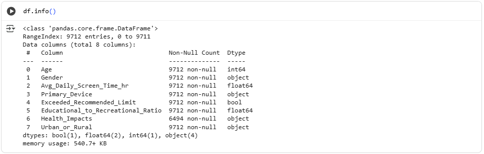
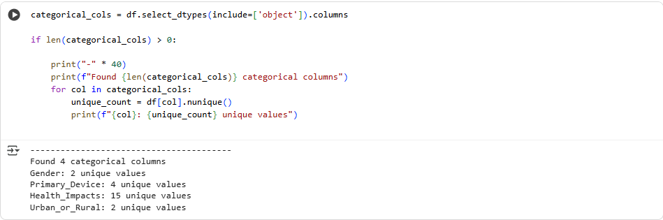
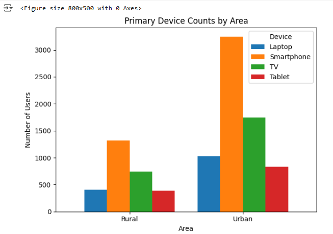

# Indian Kids Screen Time Analysis - Week 1

## About This Project

This project analyzes screen time patterns among Indian children to understand their digital device usage habits. The goal is to discover insights that can help parents, educators, and policymakers make informed decisions about children's digital wellness.

## What We're Doing in Week 1

 We want to understand what data we have, how clean it is, and what we can learn from it before diving into deeper analysis.

Our main tasks for this week:
- Load and examine the dataset
- Check for any missing or problematic data
- Understand what types of information we have
- Get a feel for the overall data quality

### What You Need

Before running the analysis, make sure you have Python installed on your computer along with these libraries:
- pandas (for working with data)
- numpy (for numerical operations) 

## What the Script Does

Our Week 1 analysis script walks through several important steps:

**Loading the Data**
First, we load the CSV file containing our screen time data and make sure it loaded correctly.

**Basic Overview**
We check how big our dataset is (how many rows and columns) and how much memory it uses.

**Missing Data Check**
We look for any missing values that might cause problems in our analysis later.

**Data Types**
We examine what types of data we have - things like numbers, text, dates, etc.

**Column Analysis**
For numerical columns, we get basic statistics like averages and ranges. For text columns, we see how many unique values there are.

**Quality Assessment**
Finally, we give an overall assessment of how good our data quality is and whether we're ready to move forward.

## Output

