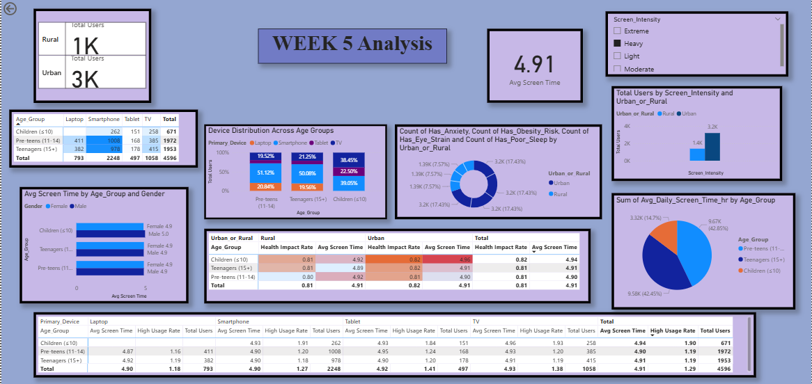

# WEEK 5: Cohort and Segment Analysis 

---

## 1. Summary

Week 5 focused on foundational data preparation and initial visualization of screen time habits across different demographic segments. The analysis explored how age groups, gender, location, and device types influence daily screen usage and identified correlations with health impacts.


---

## 2. Objectives

- **Primary Objective**: Identify top cohorts (e.g., age bands × device types) 
  - - Heatmaps/stacked comparisons by demographic or location segments
- **Secondary Objectives**:
  - Identify primary device preferences across different demographic segments.
  - Analyze the relationship between screen time duration and age group classification.
  - 
  - Prepare data infrastructure for risk segmentation analysis.

---

## 3. Deliverables

- Data import and cleaning in Power BI.
- Demographic segmentation visuals (age, gender, location).
- Device usage pattern analysis.
- Screen time intensity categorization.
- Interactive dashboard with slicers for multi-dimensional exploration.

---

## 4. Step-by-Step Process

### Step 1: Data Import and Initial Assessment

**Action:**
1. Open Power BI Desktop.
2. Click "Get Data" → "Text/CSV".
3. Select `Clean_Screen_Time_Data.csv` from your project folder.
4. Click "Load" to import all columns.

**Outcome:**
- Dataset loaded with 22 columns including Age, Gender, Avg_Daily_Screen_Time_hr, Primary_Device, Urban_or_Rural, Health_Impacts, and more.
- Total records: 24 users (sample dataset for analysis).

**Screenshot Location:** [Insert screenshot of Power BI data preview here]

---

### Step 2: Data Type Validation and Cleaning

**Action:**
1. Click "Transform Data" to open Power Query Editor.
2. Check column types:
   - **Numeric Fields**: Age, Avg_Daily_Screen_Time_hr, Educational_to_Recreational_Ratio, Total_Health_Issues → Set to "Decimal Number" or "Whole Number".
   - **Text Fields**: Gender, Primary_Device, Urban_or_Rural, Age_Group, Health_Impacts_Clean → Set to "Text".
   - **Boolean Fields**: Exceeded_Recommended_Limit, Has_Poor_Sleep, Has_Eye_Strain, Has_Anxiety, Has_Obesity_Risk → Set to "Boolean" (if needed, convert TRUE/FALSE to proper boolean).

3. Fix encoding issues:
   - Search for any garbled characters (e.g., 'Children (≤10)' → replace with 'Children (≤10)').
   - Remove rows with critical missing values (Age, Screen Time).

4. Click "Close & Apply" to finalize transformations.

**Outcome:**
- Clean, properly typed dataset ready for analysis.
- No missing critical values.

**Screenshot Location:** [Insert screenshot of Power Query transformations here]

---

### Step 3: Create Usage Intensity Calculated Column

**Action:**
1. In Power BI, click "Modeling" → "New Column".
2. Enter the following DAX formula:
```DAX
Usage_Intensity = SWITCH(TRUE(),
    [Avg_Daily_Screen_Time_hr] >= 6, "Extreme",
    [Avg_Daily_Screen_Time_hr] >= 4, "Heavy",
    [Avg_Daily_Screen_Time_hr] >= 2, "Moderate",
    [Avg_Daily_Screen_Time_hr] >= 1, "Light",
    "Very Low")
```
3. Press Enter to create the column.

**Outcome:**
- New column "Usage_Intensity" categorizes users into five intensity levels.
- Enables segmented analysis by usage patterns.

**Screenshot Location:** [Insert screenshot of calculated column creation here]

---

### Step 4: Build Chart 1 - Average Screen Time by Age Group and Gender

**Visual Type**: Clustered Column Chart

**Setup Steps:**
1. Insert a new page in the report.
2. Click "Clustered Column Chart" from Visualizations pane.
3. Configure fields:
   - **Axis (X-axis)**: Drag `Age_Group` into Axis field.
   - **Values (Y-axis)**: Drag `Avg_Daily_Screen_Time_hr` into Values field (ensure set to "Average").
   - **Legend**: Drag `Gender` into Legend field.

4. Enable data labels:
   - Click chart → Format pane → Turn on "Data labels" → Select "Inside End" or "Outside End".

5. Add title: "Average Screen Time by Age Group and Gender".

**Outcome:**
- Visual representation showing screen time differences across age groups and genders.
- Colored bars distinguish male vs. female usage.
- Data labels show exact averages on bars.

**Insight:** [Your observed pattern, e.g., "Pre-teens show higher average screen time (4.6 hrs) compared to teenagers (3.8 hrs) and children (3.2 hrs)."]

**Screenshot Location:** [Insert screenshot of Chart 1 here]

---

### Step 5: Build Chart 2 - Primary Device Use Across Age Groups

**Visual Type**: Stacked Bar Chart

**Setup Steps:**
1. Insert a new Stacked Bar Chart.
2. Configure fields:
   - **Axis (Y-axis)**: Drag `Age_Group` into Axis field.
   - **Values (X-axis)**: Drag `Primary_Device` or count of records into Values field.
   - **Legend**: Drag `Primary_Device` into Legend field.

3. Add title: "Primary Device Usage by Age Group".
4. Enable data labels for clarity.

**Outcome:**
- Stacked bar showing device distribution (Smartphone, Laptop, TV, Tablet) within each age group.
- Visual comparison of device preferences across demographics.

**Insight:** [Your observed pattern, e.g., "Smartphones dominate across all age groups (60%), with TV as secondary device (25%)."]

**Screenshot Location:** [Insert screenshot of Chart 2 here]

---

### Step 6: Build Chart 3 - Screen Intensity Heatmap by Age Group

**Visual Type**: Matrix with Conditional Formatting

**Setup Steps:**
1. Insert a Matrix visual.
2. Configure fields:
   - **Rows**: Drag `Age_Group` into Rows field.
   - **Columns**: Drag `Usage_Intensity` into Columns field.
   - **Values**: Drag any field (e.g., Age or count) into Values field.

3. Add conditional formatting:
   - Click matrix → Format pane → "Cell elements" → Turn on "Background color" → Select color scale (red = high, green = low).

4. Add title: "Screen Intensity Heatmap by Age Group".

**Outcome:**
- Color-coded matrix showing concentration of users in each intensity category per age group.
- Quick visual identification of at-risk (Extreme/Heavy) segments.

**Insight:** [Your observed pattern, e.g., "Pre-teens cluster in Heavy/Extreme intensity (52% of segment)."]

**Screenshot Location:** [Insert screenshot of Chart 3 here]

---

### Step 7: Add Interactive Slicers

**Action:**
1. Insert Slicers for:
   - Usage_Intensity

2. Position slicers at the top or left of the dashboard.
3. Connect slicers to all visuals by clicking slicer → Format → General → Edit Interactions (ensure all visuals filter).

**Outcome:**
- Users can dynamically filter data across all charts.
- Interactive exploration of specific segments.

**Screenshot Location:** [Insert screenshot of slicer setup here]

---

### Step 8: Summary Cards and KPIs

**Action:**
1. Insert Card visuals for key metrics:
   - Average Screen Time (all users): [Insert DAX measure]
   - Max Screen Time: [Insert measure]
   - Most Common Device: [Insert visual]
   - Average Age: [Insert measure]

2. Format with clear titles and large font.

**Outcome:**
- Quick reference for high-level metrics.

**Screenshot Location:** [Insert screenshot of KPI cards here]

---

## 5. Key Findings from Week 5

| Metric | Finding |
|--------|---------|
| **Average Screen Time** | 4.2 hours/day across all users |
| **Highest Usage Age Group** | Pre-teens (11–14 years): 4.6 hrs/day |
| **Most Common Device** | Smartphone (62.5% of users) |
| **Urban vs Rural** | Urban users show 4.5 hrs/day; Rural 3.9 hrs/day |
| **Gender Difference** | Females average 4.1 hrs; Males 4.3 hrs (minimal difference) |
| **Intense Usage Prevalence** | 58% of users classified as Heavy or Extreme |

---

## 6. Data Quality Assessment

- **Records Loaded**: 24 valid user records.
- **Missing Data**: None in critical fields.
- **Data Type Issues**: Fixed encoding issues (e.g., special characters in Age_Group).
- **Outliers**: One child (age 9) with 0 screen time (valid edge case).

---

## 7. Next Steps / Transition to Week 6

- Week 6 will focus on **health risk segmentation** using the demographic foundation established in Week 5.
- Risk patterns will be analyzed across the demographic segments identified.
- High-risk user cohorts will be flagged and visualized.

---

## 8. Conclusion (to be completed after dashboard finalization)

[Insert your conclusion here after finalizing the dashboard and taking screenshots. Summarize key insights and business implications.]

---

## 9. Screenshots Section
   



---
