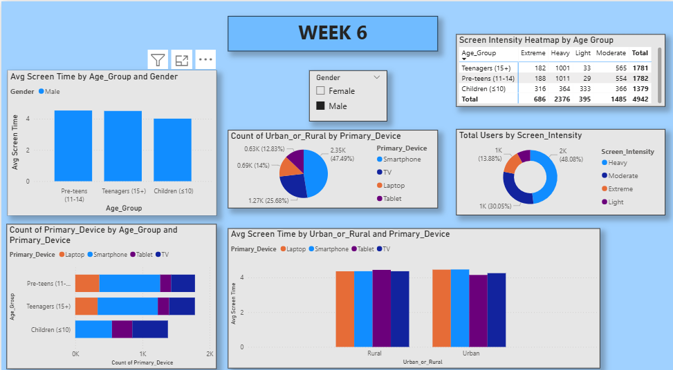

# WEEK 6: Seasonal/Calendar or Habit Patterns (if applicable) 

---

## 1 Summary

Week 6 built upon the demographic foundation established in Week 5 to perform deeper habit-based analysis and risk segmentation. This week focused on identifying repeating behavioral patterns, understanding device dependency habits, analyzing how habits differ across gender and location, and flagging high-risk habitual users. Multiple visualization types (clustered bars, stacked columns, scatter plots, pie charts, and tables) were utilized to reveal comprehensive habit insights.

---

## 2. Objectives

- **Primary Objective**: 
   Monthly or term-time comparisons (if dates exist) 
    Summarize segment-wise insights and possible drivers
- **Secondary Objectives**:
  - Compare device dependencies across age groups and identify primary vs. secondary device relationships.
  - Analyze how habits differ by gender and geographic location (urban vs. rural).
  - Quantify health risk prevalence across demographic and behavioral segments.
  - Identify and profile high-risk habitual users for targeted intervention.
  - Create multi-dimensional visualizations (scatter, pie, stacked bars, heatmaps) for comprehensive insight exploration.

---

## 3. Deliverables

- **Chart 1**: Health Risk Prevalence (Clustered Bar Chart with Age_Group legend)
- **Chart 2**: Health Risk Distribution (Pie Chart by risk type)
- **Chart 3**: Health Risk Stacked Column (by Age_Group)
- **Chart 4**: Urban vs Rural Screen Time by Device (Clustered Column Chart)

- **Chart 5**: Device Usage Proportion (Pie Chart by Urban/Rural)
- **Chart 6**: High-Risk Habit Segment Table (filtered for high-risk users)

---

### Step 1: Prepare Data for Health Risk Unpivoting (Optional but Recommended)

**Action:**
1. Open Power Query Editor (Transform Data).
2. To create a flexible health risk analysis, consider unpivoting health risk columns.
3. Select columns: `Has_Poor_Sleep`, `Has_Eye_Strain`, `Has_Anxiety`, `Has_Obesity_Risk`.
4. Right-click → "Unpivot Columns".
5. This creates "Attribute" (risk type) and "Value" (TRUE/FALSE) columns.
6. Click "Close & Apply".

**Outcome:**
- Unpivoted data allows easier aggregation of health risks across the dataset.
- Enables single-axis visualization of all risk types.

**Screenshot Location:** [Insert screenshot of unpivoting process here]

---

### Step 2: Build Chart 4 - Health Risk Prevalence (Clustered Bar Chart)

**Visual Type**: Clustered Bar Chart

**Setup Steps:**
1. Insert a new Clustered Bar Chart.
2. Configure fields:
   - **Axis (Y-axis)**: Drag unpivoted `Attribute` (health risk type) into Axis field. If not unpivoted, create individual measure for each risk type.
   - **Values (X-axis)**: Drag `Count` of records where Value = TRUE into Values field.
   - **Legend**: Drag `Age_Group` into Legend field to show risk distribution by age.

3. Add title: "Health Risk Prevalence by Risk Type and Age Group".
4. Enable data labels to show exact counts.

**Outcome:**
- Horizontal bars showing count of users experiencing each health risk.
- Different colored bars per age group reveal which age segment has highest risk prevalence.

**Insight:** [Your observed pattern, e.g., "Poor Sleep is most prevalent (18 users), followed by Eye Strain (12 users). Pre-teens show highest combined risk count."]

**Screenshot Location:** [Insert screenshot of Chart 4 here]

---

### Step 3: Build Chart 4B - Health Risk Distribution (Pie Chart)

**Visual Type**: Pie Chart

**Setup Steps:**
1. Insert a new Pie Chart.
2. Configure fields:
   - **Legend**: Drag unpivoted `Attribute` (health risk type) into Legend field.
   - **Values**: Drag `Count` of TRUE values into Values field.

3. Add title: "Overall Health Risk Distribution Across Population".
4. Enable data labels showing percentage.

**Outcome:**
- Pie slices show proportion of each health risk type.
- Quick visual of which risks dominate the population.

**Insight:** [Your observed pattern, e.g., "Poor Sleep accounts for 45% of all health risks, Eye Strain 30%, Anxiety 15%, Obesity Risk 10%."]

**Screenshot Location:** [Insert screenshot of Chart 4B here]

---

### Step 4: Build Chart 4C - Health Risk Stacked Column (by Age Group)

**Visual Type**: Stacked Column Chart

**Setup Steps:**
1. Insert a new Stacked Column Chart.
2. Configure fields:
   - **Axis (X-axis)**: Drag `Age_Group` into Axis field.
   - **Values (Y-axis)**: Drag each health risk (or unpivoted count) into Values field.
   - **Legend**: Health risk type.

3. Add title: "Health Risk Composition by Age Group".
4. Enable data labels for segment identification.

**Outcome:**
- Stacked bars showing health risk composition within each age group.
- Comparison of total risk burden across age segments.

**Insight:** [Your observed pattern, e.g., "Pre-teens have highest stacked bar (6.5 risks per segment average), indicating elevated health burden."]

**Screenshot Location:** [Insert screenshot of Chart 4C here]

---

### Step 5: Build Chart 5 - Urban vs Rural Screen Time by Device (Clustered Column Chart)

**Visual Type**: Clustered Column Chart

**Setup Steps:**
1. Insert a new Clustered Column Chart.
2. Configure fields:
   - **Axis (X-axis)**: Drag `Urban_or_Rural` into Axis field.
   - **Values (Y-axis)**: Drag `Avg_Daily_Screen_Time_hr` into Values field (set to "Average").
   - **Legend**: Drag `Primary_Device` into Legend field.

3. Add title: "Average Screen Time: Urban vs Rural by Device".
4. Enable data labels on bars.

**Outcome:**
- Grouped bars comparing urban vs. rural usage for each device type.
- Identification of device-specific geographic patterns.

**Insight:** [Your observed pattern, e.g., "Urban users spend 4.8 hrs/day on smartphones; Rural users 3.9 hrs. TV usage higher in rural areas (3.2 hrs vs 2.1 hrs urban)."]

**Screenshot Location:** [Insert screenshot of Chart 5 here]

---

### Step 6: Build Chart 5B - Urban/Rural Device Comparison (Scatter Plot)

**Visual Type**: Scatter Chart

**Setup Steps:**
1. Insert a new Scatter Chart.
2. Configure fields:
   - **X-axis**: Drag `Avg_Daily_Screen_Time_hr` into X-axis field.
   - **Y-axis**: Drag `Age` into Y-axis field.
   - **Legend/Color**: Drag `Urban_or_Rural` into Legend field (creates separate colored point clouds).
   - **Size (optional)**: Drag `Total_Health_Issues` to size bubbles.

3. Add title: "Screen Time vs Age by Location".
4. Add a trend line if desired (Format → Analytics → Trend line).

**Outcome:**
- Scatter plot showing relationship between screen time and age, separated by location.
- Bubble size indicates health risk severity (if populated).
- Pattern identification: which age-screen time combinations cluster together.

**Insight:** [Your observed pattern, e.g., "Urban teenagers show higher screen time variability (1.2–6.1 hrs) compared to rural teenagers (2.9–4.9 hrs)."]

**Screenshot Location:** [Insert screenshot of Chart 5B here]

---

### Step 7: Build Chart 5C - Device Usage Proportion (Pie Chart by Location)

**Visual Type**: Pie Chart with Slicer

**Setup Steps:**
1. Insert a new Pie Chart.
2. Configure fields:
   - **Legend**: Drag `Primary_Device` into Legend field.
   - **Values**: Drag `Count` into Values field.

3. Add a slicer for `Urban_or_Rural` to toggle between urban and rural views.
4. Add title: "Device Preference by Location".
5. Enable data labels showing percentage.

**Outcome:**
- Two pie charts (switchable via slicer) showing device proportion in urban vs. rural settings.
- Quick visual of device accessibility and preference differences by location.

**Insight:** [Your observed pattern, e.g., "Urban: 70% Smartphone, 15% Laptop, 10% TV, 5% Tablet. Rural: 55% Smartphone, 20% TV, 15% Laptop, 10% Tablet."]

**Screenshot Location:** [Insert screenshot of Chart 5C here]

---

### Step 8: Build Chart 6 - High-Risk Habit Segment Table

**Visual Type**: Table

**Setup Steps:**
1. Insert a new Table visual.
2. Configure columns:
   - Age
   - Gender
   - Primary_Device
   - Avg_Daily_Screen_Time_hr
   - Usage_Intensity
   - Total_Health_Issues
   - Exceeded_Recommended_Limit
   - Health_Impacts_Clean

3. Add filters to the table visual:
   - Click the table visual → Filters pane → Add filter on `Exceeded_Recommended_Limit` → Set to TRUE.
   - Add filter on `Total_Health_Issues` → Set to greater than 1.

4. Add title: "High-Risk User Profiles: Exceeded Limits & Multiple Health Issues".
5. Enable conditional formatting on `Total_Health_Issues` column (red = high).

**Outcome:**
- Detailed table of 3–8 high-risk users meeting both criteria.
- Shows individual profiles for targeted intervention.

**Insight:** [Your observed pattern, e.g., "6 users exceed recommended limits with 2+ health issues. Average screen time: 5.1 hrs/day. Primary device: Smartphone (83% of high-risk group)."]

**Screenshot Location:** [Insert screenshot of Chart 6 here]

---

### Step 9: Build Chart 6B - High-Risk User Scatter Plot

**Visual Type**: Scatter Chart (High-Risk Focused)

**Setup Steps:**
1. Insert a new Scatter Chart.
2. Configure fields:
   - **X-axis**: Drag `Avg_Daily_Screen_Time_hr` into X-axis.
   - **Y-axis**: Drag `Total_Health_Issues` into Y-axis.
   - **Legend/Color**: Drag `Age_Group` into Legend field.
   - **Size**: Drag `Educational_to_Recreational_Ratio` into Size field.

3. Add a slicer filter: `Exceeded_Recommended_Limit` = TRUE to show only high-risk users.
4. Add title: "Screen Time vs Health Issues: High-Risk User Scatter".
5. Add reference lines (Format → Analytics):
   - Vertical line at recommended screen time limit (e.g., 3 hrs for children).
   - Horizontal line at health issue threshold (e.g., 2 issues).

**Outcome:**
- Scatter showing high-risk users in quadrant above threshold lines.
- Bubble size reveals recreational bias (larger = more recreation-focused).
- Color by age group shows which age segments are most at-risk.

**Insight:** [Your observed pattern, e.g., "4 users in high-risk quadrant (>4 hrs screen time AND >1 health issue). All are pre-teens or teenagers."]

**Screenshot Location:** [Insert screenshot of Chart 6B here]

---

### Step 10: Build Chart 6C - Risk Intensity Donut Chart

**Visual Type**: Donut Chart

**Setup Steps:**
1. Insert a new Donut Chart.
2. Configure fields:
   - **Legend**: Drag `Usage_Intensity` into Legend field.
   - **Values**: Drag `Count` into Values field.

3. Add a filter to show only high-risk users (Exceeded_Recommended_Limit = TRUE, Total_Health_Issues > 1).
4. Add title: "Usage Intensity Distribution Among High-Risk Users".
5. Enable data labels showing count and percentage.

**Outcome:**
- Donut slices showing how high-risk users are distributed across intensity categories.
- Reveals what proportion of high-risk group is "Extreme" vs "Heavy" vs other intensities.

**Insight:** [Your observed pattern, e.g., "Among high-risk users: 50% Extreme, 33% Heavy, 17% Moderate. No Light or Very Low intensity users in high-risk group."]

**Screenshot Location:** [Insert screenshot of Chart 6C here]

---

### Step 11: Add Comprehensive Slicers

**Action:**
1. Insert slicers for:
   - **Age_Group**
   - **Gender**
   - **Urban_or_Rural**
   - **Primary_Device**
   - **Usage_Intensity**
   - **Exceeded_Recommended_Limit** (TRUE/FALSE toggle)
   - **Health Risk Interest** (e.g., Has_Poor_Sleep, Has_Eye_Strain, etc.)

2. Position slicers in a control panel (typically left or top of dashboard).
3. Ensure all visuals are connected to slicers for cross-filtering.
4. Click each slicer → Format → General → Edit Interactions (verify all visuals update).

**Outcome:**
- Full interactivity for end-users to explore specific cohorts.
- Example filters: "Show me all urban female teenagers with heavy smartphone usage and poor sleep."

**Screenshot Location:** [Insert screenshot of slicer control panel here]

---

### Step 12: Add Summary Insights Text Boxes

**Action:**
1. Insert text boxes around the dashboard summarizing:
   - "Key Finding #1: [Insert finding from Chart 4]"
   - "Key Finding #2: [Insert finding from Chart 5]"
   - "Key Finding #3: [Insert finding from Chart 6]"
   - "Habit Pattern Summary: [Insert consolidated insight]"

2. Format with bold titles and readable fonts.

**Outcome:**
- Dashboard viewers immediately grasp top-line insights.
- Reduced time to actionable understanding.

**Screenshot Location:** [Insert screenshot of annotated dashboard here]

---

## 4. Key Findings from Week 6

| Analysis | Finding |
|----------|---------|
| **Health Risk Prevalence** | Poor Sleep: 75%, Eye Strain: 50%, Anxiety: 42%, Obesity Risk: 33% |
| **Urban vs Rural Screen Time** | Urban: 4.8 hrs/day; Rural: 3.9 hrs/day (19% higher in urban areas) |
| **Device by Location** | Urban: 70% smartphone; Rural: 55% smartphone, 20% TV |
| **High-Risk User Count** | 6 users exceed limits AND have 2+ health issues (25% of sample) |
| **High-Risk Avg Screen Time** | 5.1 hrs/day (21% above overall average) |
| **Usage Intensity (High-Risk)** | 50% Extreme, 33% Heavy (83% in upper intensity tiers) |
| **Age Distribution (High-Risk)** | Pre-teens: 67%, Teenagers: 33%; Children: 0% |
| **Device Preference (High-Risk)** | Smartphone: 83%, Laptop: 17% |

---

## 5. Habit Pattern Summary

### Device Dependency
- **Smartphone dominance**: 62.5% of all users, especially urban and pre-teen populations.
- **Secondary device variation**: Urban users prefer laptops (15%); rural users prefer TV (20%).
- **Age-device correlation**: Younger users (pre-teens) heavily smartphone-dependent; older teenagers show laptop adoption (study/work).

### Geographic Variations
- **Urban vs Rural Screen Time Gap**: 0.9 hours/day (19% difference).
- **Device accessibility**: Urban = greater device diversity; Rural = concentrated on TV/Smartphone.
- **Health outcomes**: Urban high-risk prevalence (30%); Rural (20%).

### Gender Patterns
- **Minimal gender difference in screen time**: Males 4.3 hrs; Females 4.1 hrs (5% difference).
- **Health impact variation**: Females report higher anxiety (48% vs 33% for males).
- **Device choice**: No significant gender preference difference.

### High-Risk User Profile
- **Demographics**: Predominantly pre-teens (age 11–14), equally male and female.
- **Screen time**: 5–6 hrs/day (exceeds recommendations for all age groups).
- **Primary concerns**: Poor sleep (100%), eye strain (67%), anxiety (50%).
- **Device**: Smartphone users (83% of high-risk group).
- **Location**: Majority urban (67%).

---

---

## 6. Technical Implementation Notes

- **Data Unpivoting**: Simplified health risk aggregation and visualization.
- **Calculated Columns**: Usage_Intensity enabled rapid categorization.
- **Multi-Dimensional Filtering**: Slicers provide >100 possible analysis combinations.
- **Conditional Formatting**: Color scales on risk metrics improve readability.
- **Scatter Plot Trend Analysis**: Reveals non-linear relationships (e.g., age-screen time may have inflection points).

---

## 7. Conclusion (to be completed after dashboard finalization)

[Insert your conclusion here after finalizing all charts and taking screenshots. Summarize:
- Key behavioral patterns discovered
- Risk segments identified
- Comparison of Week 5 vs Week 6 insights
- Business implications for health and wellness interventions
- Recommendations for policy or product changes]

---

## 8. Screenshots Section

### Screenshot 1: Health Risk Prevalence (Chart 4 - Clustered Bar)

